# 🏗️ Blood Suite System Design Documentation

## 📋 **System Overview**

Blood Suite is a comprehensive blood bank management system that connects donors, hospitals, and blood inventory through a modern web application with real-time capabilities.

---

## 🎯 **Use Case Diagrams**

### **1. Actor Identification**

#### **Primary Actors**
- **Donor**: Individuals who donate blood
- **Hospital Staff**: Medical professionals managing blood inventory
- **System Administrator**: System configuration and user management
- **Blood Bank Manager**: Overall blood bank operations

#### **Secondary Actors**
- **External API**: Third-party integrations
- **Notification System**: Email/SMS services
- **Database**: PostgreSQL data storage

---

### **2. Donor Use Cases**

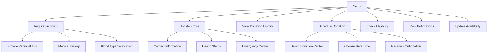

#### **Donor Use Case Details**

| Use Case | Description | Precondition | Postcondition |
|-----------|-------------|---------------|----------------|
| **Register Account** | Create new donor account with medical profile | Valid email, 18+ years old | Account created, profile pending verification |
| **Update Profile** | Modify personal and medical information | Logged in donor | Profile updated, eligibility recalculated |
| **View Donation History** | Access past donation records | Logged in donor | Display donation dates, locations, amounts |
| **Schedule Donation** | Book future donation appointment | Eligible donor | Appointment scheduled, notification sent |
| **Check Eligibility** | Verify donation eligibility | Logged in donor | Display eligibility status and next eligible date |
| **View Notifications** | Access system alerts and updates | Logged in donor | Display unread notifications count and messages |

---

### **3. Hospital Staff Use Cases**

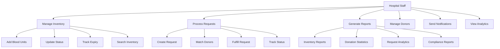

#### **Hospital Staff Use Case Details**

| Use Case | Description | Precondition | Postcondition |
|-----------|-------------|---------------|----------------|
| **Manage Inventory** | Add, update, and track blood units | Logged in staff | Inventory updated, alerts for expiring units |
| **Process Requests** | Handle blood requests from patients | Logged in staff | Request processed, donors notified if needed |
| **Generate Reports** | Create various management reports | Logged in staff | Reports generated and exported |
| **Manage Donors** | View and manage donor information | Logged in staff | Donor records updated |
| **Send Notifications** | Send alerts to donors and staff | Logged in staff | Notifications queued and delivered |
| **View Analytics** | Access dashboard and metrics | Logged in staff | Analytics displayed with real-time data |

---

### **4. System Administrator Use Cases**

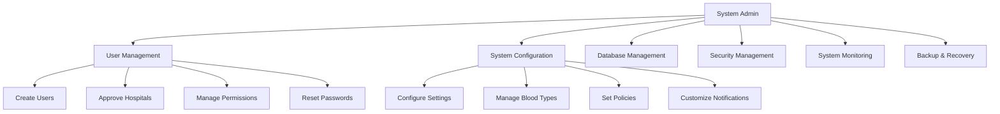

---

## 🏛️ **System Architecture**

### **1. High-Level Architecture**

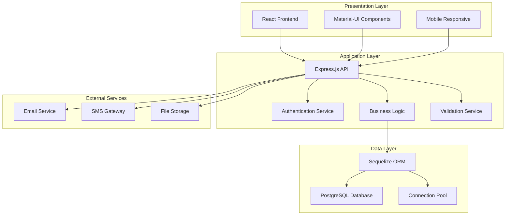

---

### **2. Component Architecture**

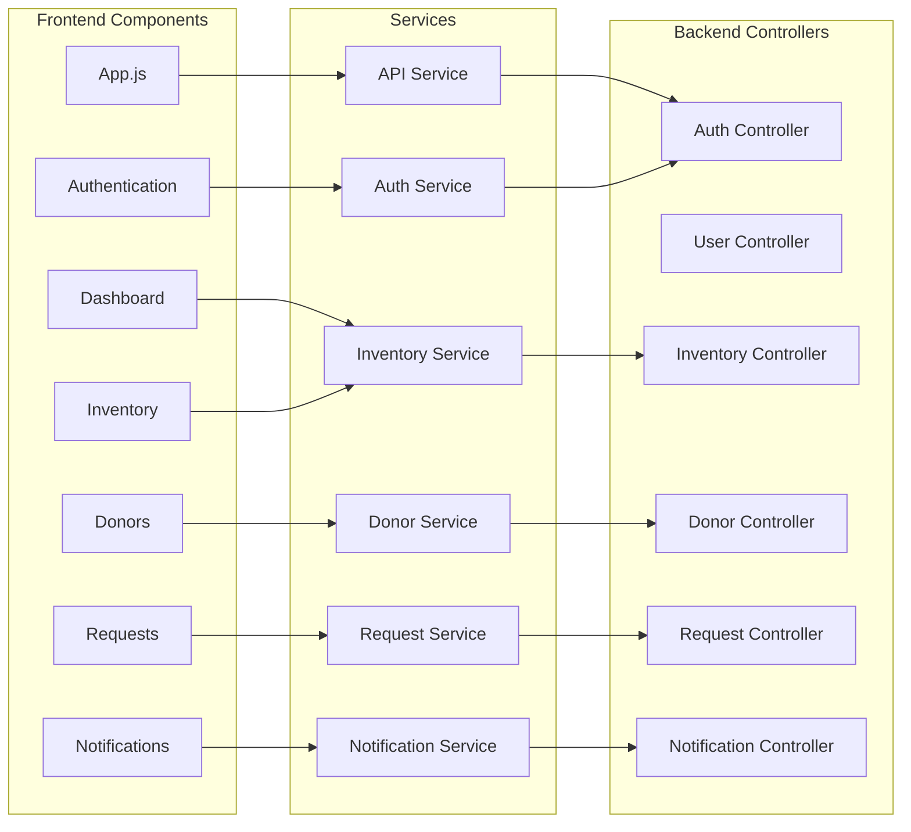

---

### **3. Database Architecture**

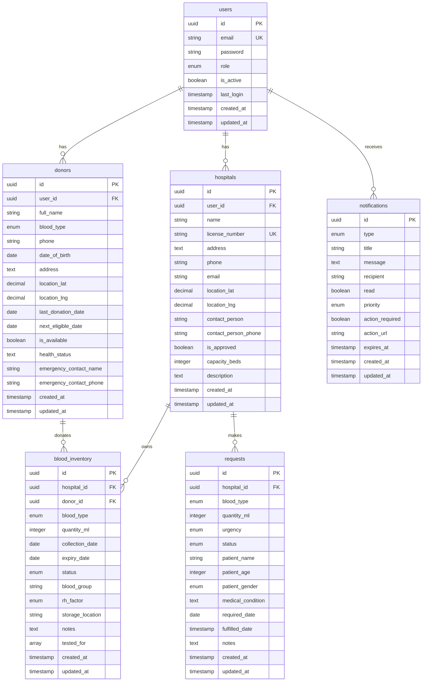

---

## 🔧 **Technical Architecture**

### **1. Technology Stack**

#### **Frontend Stack**
- **React 18**: Modern UI framework with hooks
- **Material-UI v5**: Component library and design system
- **React Router v6**: Client-side routing
- **Axios**: HTTP client for API calls
- **date-fns**: Date manipulation library
- **Recharts**: Data visualization

#### **Backend Stack**
- **Node.js**: JavaScript runtime
- **Express.js**: Web application framework
- **Sequelize**: ORM for PostgreSQL
- **JWT**: Authentication tokens
- **bcryptjs**: Password hashing
- **Helmet.js**: Security middleware
- **CORS**: Cross-origin resource sharing

#### **Database Stack**
- **PostgreSQL 12+**: Primary database
- **UUID**: Primary key generation
- **Indexes**: Performance optimization
- **Constraints**: Data integrity

---

### **2. Security Architecture**

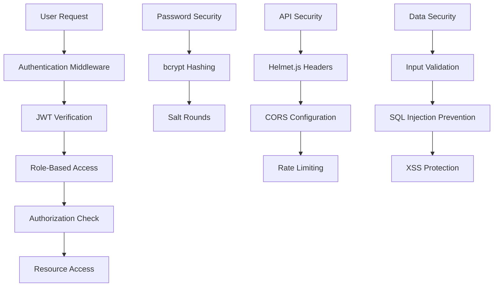

#### **Security Layers**
1. **Authentication Layer**: JWT-based authentication
2. **Authorization Layer**: Role-based access control
3. **Input Validation**: Comprehensive data validation
4. **Transport Security**: HTTPS, CORS configuration
5. **Password Security**: bcrypt with salt rounds
6. **API Security**: Rate limiting, helmet headers

---

### **3. Data Flow Architecture**

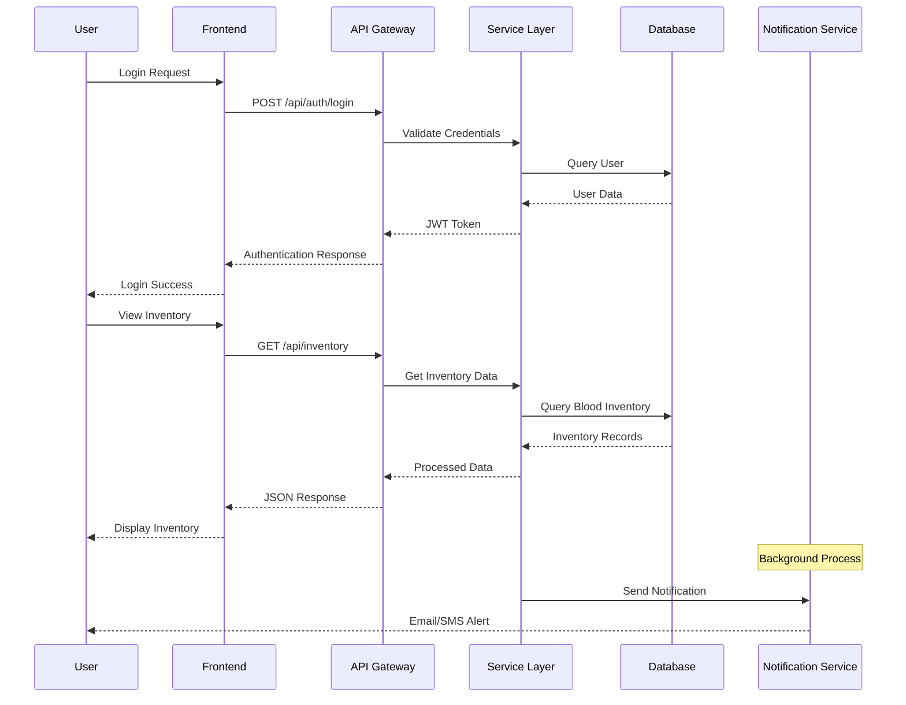

---

## 📊 **Performance Architecture**

### **1. Caching Strategy**

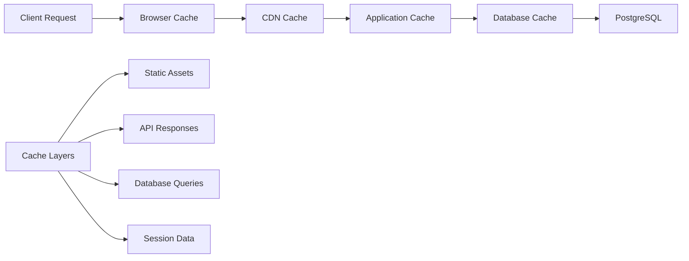

#### **Cache Implementation**
- **Browser Cache**: Static assets, CSS, JS
- **Application Cache**: API responses, user sessions
- **Database Cache**: Query results, connection pooling
- **CDN**: Static asset delivery

---

### **2. Scalability Architecture**

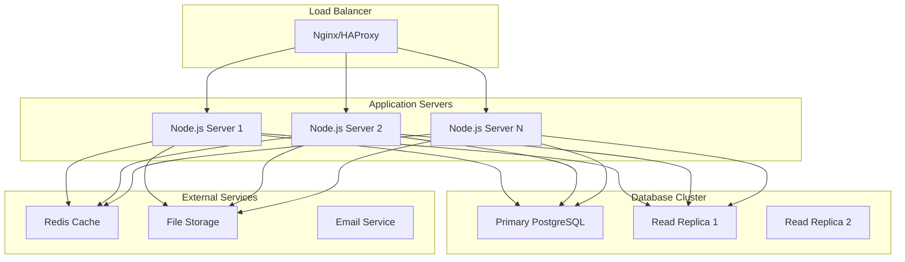

---

## 🔌 **Integration Architecture**

### **1. API Architecture**

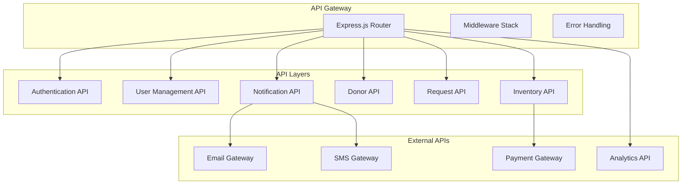

#### **API Design Principles**
- **RESTful Design**: Standard HTTP methods
- **JSON Format**: Consistent data exchange
- **Version Control**: API versioning strategy
- **Documentation**: OpenAPI/Swagger specs
- **Error Handling**: Standardized error responses

---

### **2. Microservices Architecture (Future)**

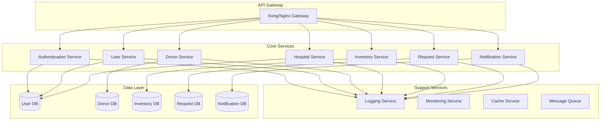

---

## 📱 **Mobile Architecture**

### **1. Responsive Design**

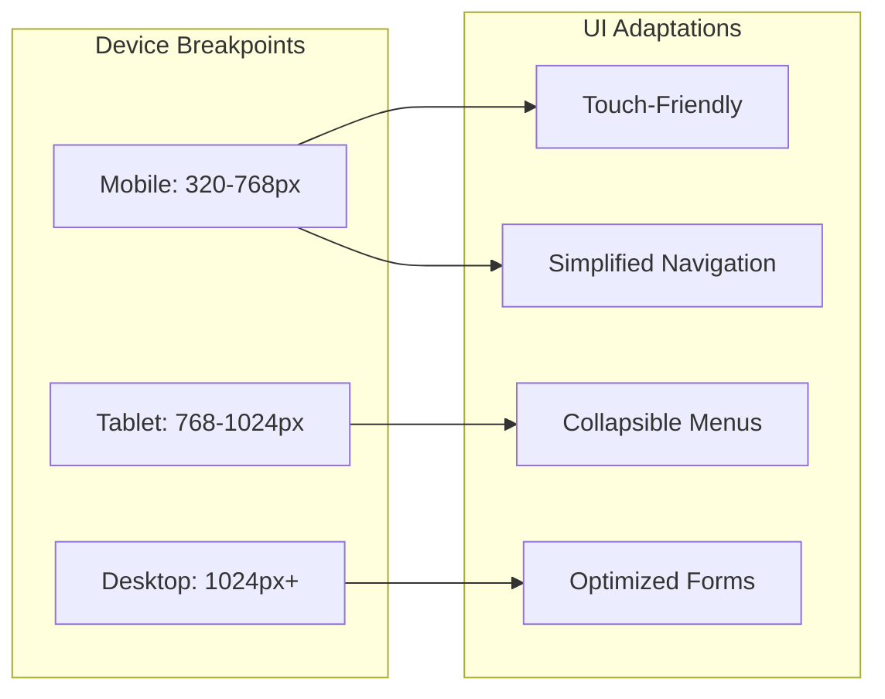

---

## 🔄 **Deployment Architecture**

### **1. Development Environment**

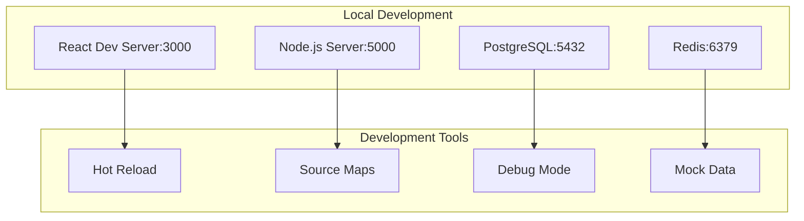

### **2. Production Environment**

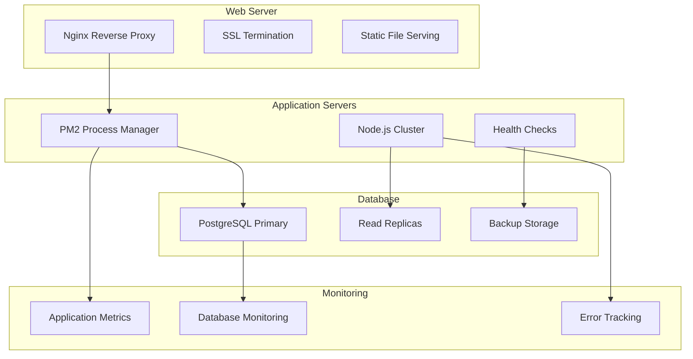

---

## 📈 **Monitoring & Analytics Architecture**

### **1. Application Monitoring**

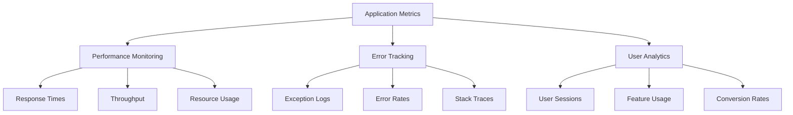

---

## 🔮 **Future Architecture Enhancements**

### **1. AI/ML Integration**

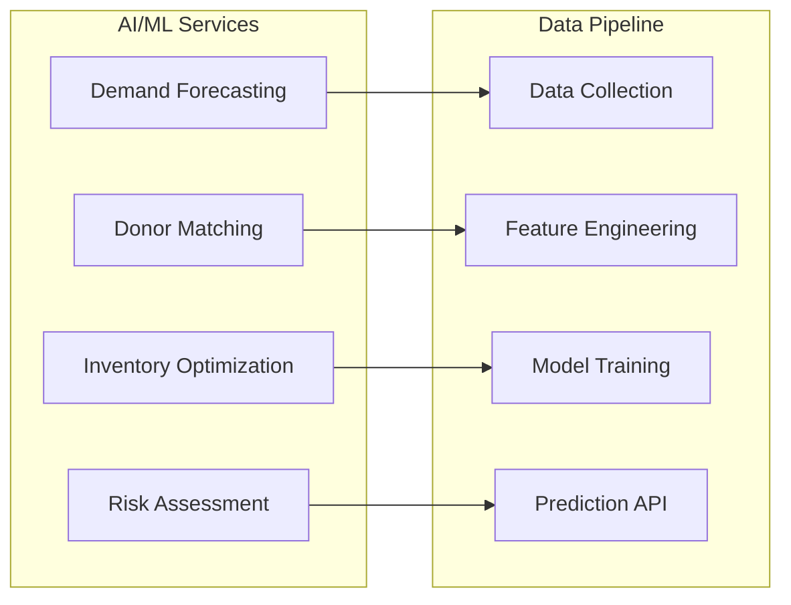

### **2. Real-time Features**

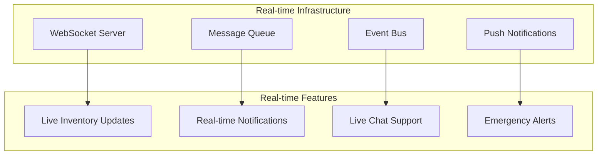

---

## 📋 **Architecture Decision Records**

### **Key Decisions**

| Decision | Rationale | Alternatives Considered |
|-----------|-----------|----------------------|
| **React + Material-UI** | Rapid development, component-based, good ecosystem | Angular, Vue.js, Custom CSS |
| **PostgreSQL** | ACID compliance, JSON support, scalability | MySQL, MongoDB, NoSQL |
| **JWT Authentication** | Stateless, scalable, mobile-friendly | Session-based, OAuth 2.0 |
| **RESTful API** | Standard, well-understood, tooling support | GraphQL, gRPC |
| **UUID Primary Keys** | Distributed, secure, non-sequential | Auto-increment integers |
| **Sequelize ORM** | Type safety, migrations, relationships | Raw SQL, TypeORM |

---

## 🎯 **System Quality Attributes**

### **Non-Functional Requirements**

| Attribute | Target | Measurement |
|-----------|---------|--------------|
| **Performance** | <200ms response time | API response monitoring |
| **Availability** | 99.9% uptime | Health checks, monitoring |
| **Scalability** | 1000+ concurrent users | Load testing |
| **Security** | Zero data breaches | Security audits |
| **Usability** | 90% user satisfaction | User feedback |
| **Maintainability** | <2 days for bug fixes | Code metrics |
| **Portability** | Cloud-agnostic | Containerization |

---

*Last Updated: February 2026*
*Architecture Version: 1.0.0*
